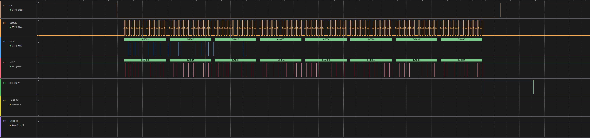
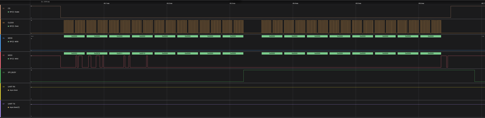
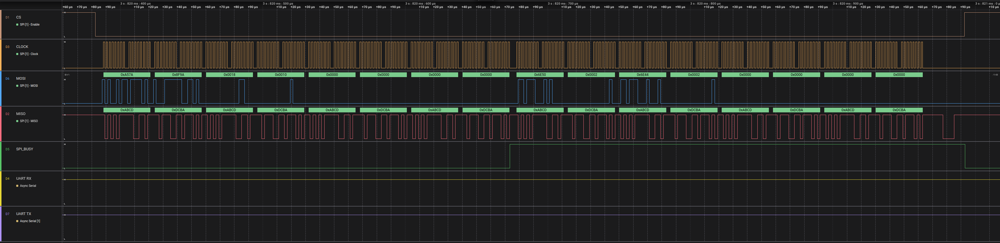
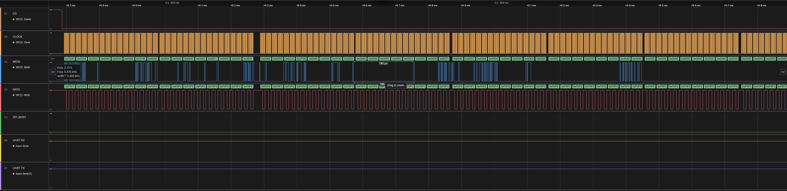
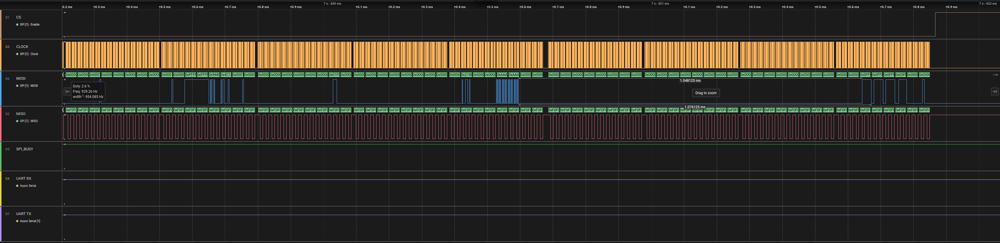
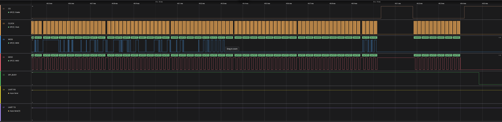
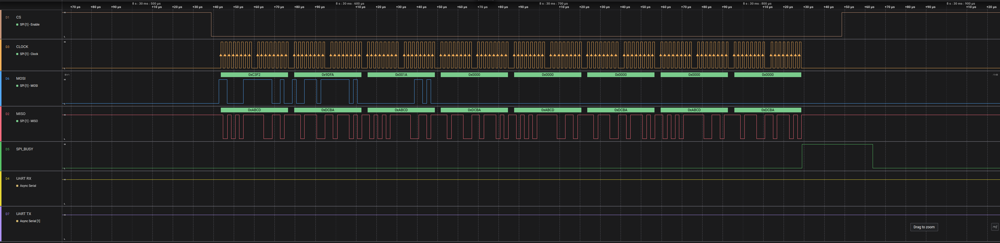
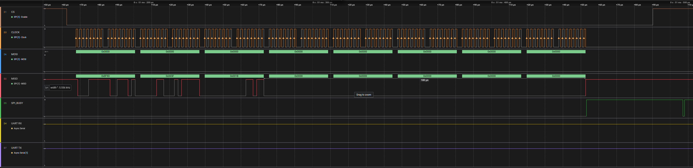

# TI IWRL6432 Tooling to Boot from SPI without a QSPI Flash by transferring the firmware over SPI to RAM and booting
This example uses a Raspberry PI 4 (RPI4) as the SPI Controller.

## Setup Ubuntu 24.04 Build Environment - Build for RPI4 Raspbian
Update the contents of your /etc/apt/sources.list to match the sources.list in this repo.

```bash
sudo dpkg --add-architecture arm64
sudo dpkg --print-foreign-architectures
sudo apt update -y
sudo apt install git build-essential cmake libdocopt-dev libuv1-dev flex bison libgtest-dev spi-tools gcc-aarch64-linux-gnu g++-aarch64-linux-gnu libgpiod-dev libgpiod-dev:arm64 
```

## Update the Raspbian environemnt on your RPI4 target
```bash
sudo apt update -y && sudo apt install libgpiod2
```

## Configure SPI on your RPI4
https://pimylifeup.com/raspberry-pi-spi/


## Initial Build
```bash
make ci
```
## Incremental Build for RPI4 Target
```bash
make build.rpi4
```

## Incremental Build for PC
```bash
make build.x86
```

## Waveforms

### Complete Saleae Waveform Capture
[Saleae Capture File](./waveform/waveform.sal)

### Full Waveform


### Device Status Command & Response

Command


Response


### Continuous Download Command & Response

Command


Response


### Continuous Download Payload (Abbreviated)

First Block


Last Complete Block


Final Partial Block with Padding



### App Switch Command & Response

Command


Response



## Notes

If the QSPI Flash is not populated in your design, you will also need to modify the chirp configuration to disable saving of calibration data to QSPI flash.

```bash
factoryCalibCfg: <save enable> <restore enable> <rxGain> <backoff0> <Flash offset>
```

